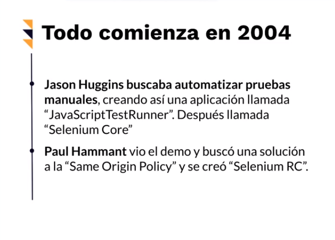
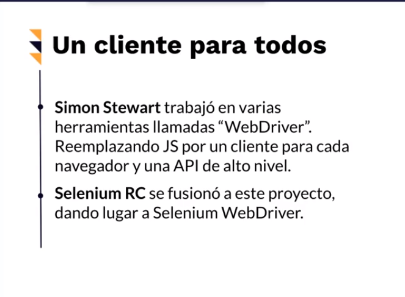
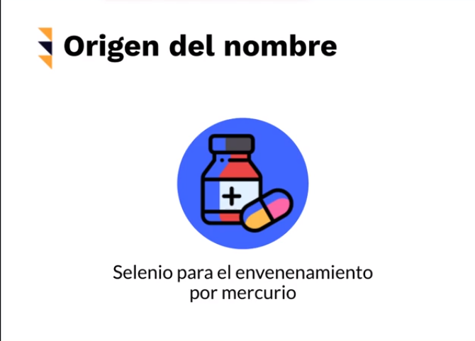
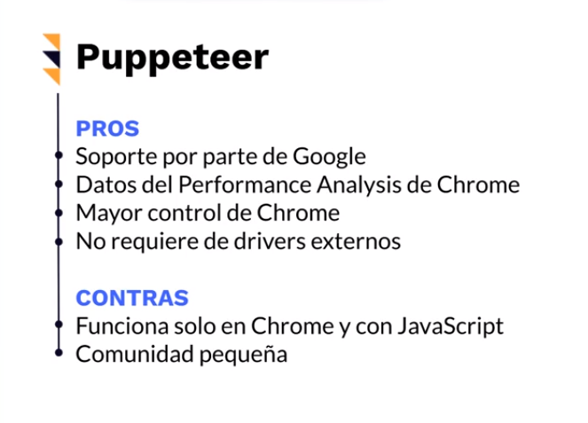
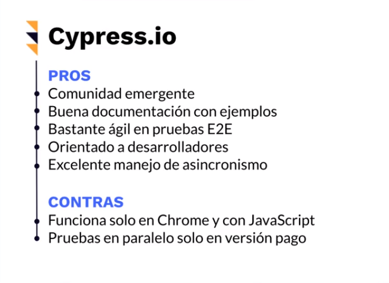

# Curso-de-introduccion-a-Selenium-con-Python
Curso de introduccion a Selenium con Python realizado en Platzi

**Contenido**

[Clase 1 Bienvenida al curso](#Clase-1-Bienvenida-al-curso)

[Clase 2 Historia de Selenium](#Clase-2-Historia-de-Selenium)

[Clase 3 Otras herramientas de testing y automatización](#Clase-3-Otras-herramientas-de-testing-y-automatización)

## Clase 1 Bienvenida al curso

Recomendaciones de cursos antes de iniciar con el de Selenium

- Curso de Introduccion al pensamiento computacional con Python 

- Curso de Programación Orientada a Objetos: POO

- Curso de desarrollo web online

- Curso de fundamentos de pruebas de software

## Clase 2 Historia de Selenium

**¿Qué es selenium?**

Es una "Suite de herramientas para automatizacion de navegadores", tambien es asociado a testing o web scraping

Selenium es compatible con navegadores como Firefox, Internet explorer, Google Chrome, Opera, Safari 

Tambien es compatible con distintos lenguajes de programacion como JAVA, C# Ruby, Python, PHP, JavaScript, PERL y Kotlin

Selenium **No es una herramienta de testing o web scraping**, se puede utilizar para esas tareas pero su desempeño en las mismas puede no ser el optimo

**Origen del nombre**

La compañia de desarrollo que creo Selenium originalmente tenia un competidor llamado Mercurial.
Cuando una persona padece intoxicación por mercurio debe consumir suplementos hechos a base de selenio para poderse curar.

Entonces el equipo de desarrollo considero una buena idea utilizar el nombre de Selenium porque como tal ofrecian una cura para lo que este competidor hacia u ofrecia.

**Caracteristicas, pros y contras de Selenium IDE**

**Pros**

- Excelente para iniciar en testing y pruebas unitarias teniendo en cuenta que funciona a base de clicks en los elementos del sitio web 

- No requiere saber programar lo que lo hace bastante util para novatos

- Exporta Scripts para Selenium RC(remote control) y Selenium WebDriver

- Genera reportes como cuanto duro una prueba, que acciones se tomaron, errores y fallas que hubo durante las pruebas

**Contras**

- Disponible solo para Firefox y Chrome

- No soporta DDT(Data-Driven-Testing), no es posible colocar datos para realizar multiples pruebas

**Caracteristicas, pros y contras de Selenium RC(Remote Control)**

**Pros**

- Soporte para varias plataformas, navegadores y lenguajes de programacion

- Operaciones logicas y condicionales cuando realizamos pruebas

- soporta DDT(Data-Driven-Testing)

- **Posee una API madura** con la que se puede llevar a cabo metodos y funciones que hacen mas agiles las pruebas

**Contras**

- Complejo de instalar (requiere instalar varios archivos)

- Necesita de un servidor corriendo (con el cual se comunica antes de poder enviar las interacciones al navegador)

- Comandos redundantes en su API (Pueden parecer a metodos que hagan lo mismo, pero por debajo funcionan de manera distinta)

- Navegacion no tan realista (Es mas robotica y rigida)

**Caracteristicas, pros y contras de Selenium WebDriver(Herramienta a utilizar en el curso)**

**Pros**

- Soporte para multiples lenguajes

- Facil de instalar

- Comunicación directa con el navegador (No requiere de un servidor intermedio)

- Interacción más realista (Como pensar que hace una persona y trasladarlo a Selenium)

**Contras**

- No soporta nuevos navegadores tan rápido o nuevas actualizaciones

- No genera reportes o resultados de pruebas

- Requiere de saber programar

**Selenium Grid**(Es un complemento)

**Caracteristicas**

- Se utiliza junto a Selenium RC(Remote Control)

- Permite correr pruebas en paralelo

- Conveniente para ahorrar tiempo

## Clase 3 Otras herramientas de testing y automatización

Selium puede no ser la herramienta de testing y automatizacion mas eficiente por lo cual hay que considerar la existencia de otro tipo de herramientas

**Puppeteer**

Tiene una comunidad pequeña por lo cual aun se esta desarrollando 

**Cyperss.io**

Una de sus ventajas mas importantes es que tiene un excelente manejo del asincronimo lo cual hace que las esperas puedan ser dinamicas y se puedan manejar de forma sencilla

**¿Cuál es la mejor opción?**

Se debe tomar en cuenta lo siguiente

- ¿Cuál es lenguaje de programación con el que mas esta familiarizado?

- ¿Qué lenguaje de programación utiliza el equipo de trabajo?

- El proyecto de trabajo requiere grandes llamadas de asincronismo o no

- Si se quiere hacer una automatizacion para hacer una tarea mas sencilla

**Porque usar Selenium durante el curso**

- Facil de utilizar

- Es compatible con muchos navegadores

- Se pueden implementar diversos lenguajes de programación que para el caso sera Python

- Se pueden lograr grandes procesos de automatización y testing